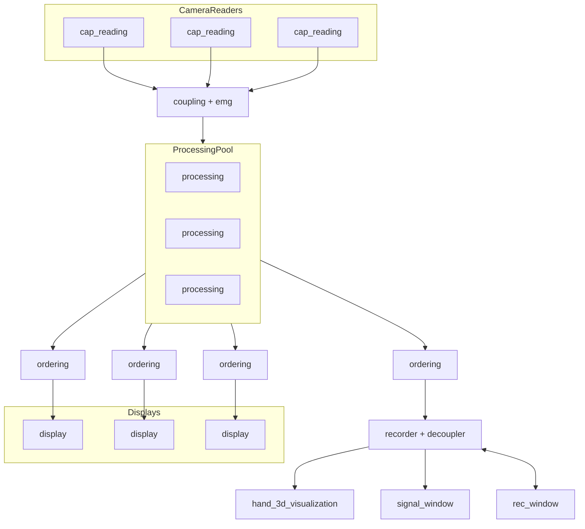

## Top-level functional diagram

> `coupling + emg` produces packets of frames that capture at the same time and the emg recorded from the last capture

> `recorder + decoupler` is doing two things:
> - splitting the processing result onto emg signal and 3d hand
> - optionally record it to a file before the split - the option to set to do so is controlled with a channel that connects to `rec_window`

> NOTE: considering that processing delay is big and displaying delay is negligible we can say that the record will be written with the data you see on the display (e.g. with some delay from the realtime actions) - e.g. the first frame to be written in the moment you press on the `rec` button is the latest processed frame - e.g. most nearly the frame you see on the display